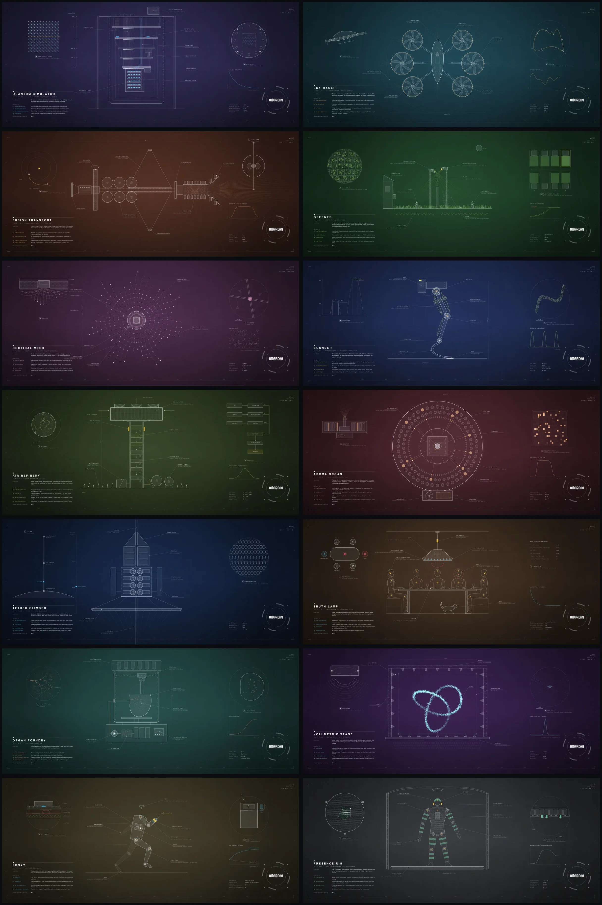
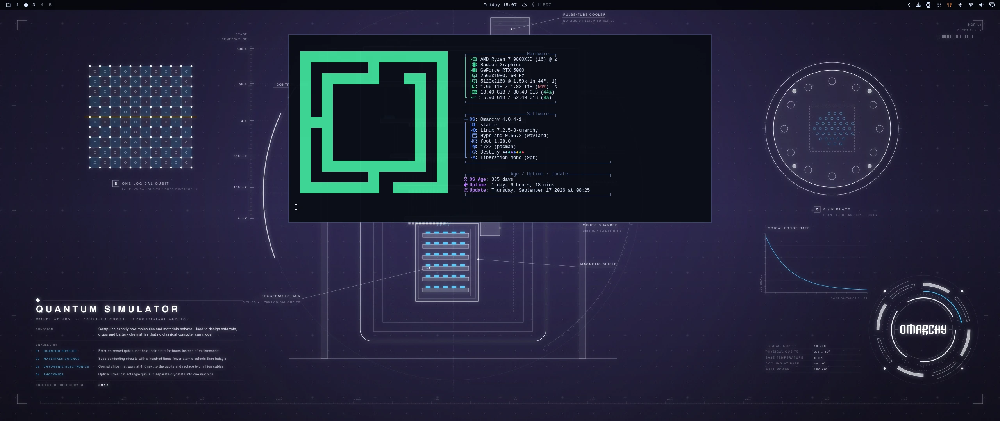
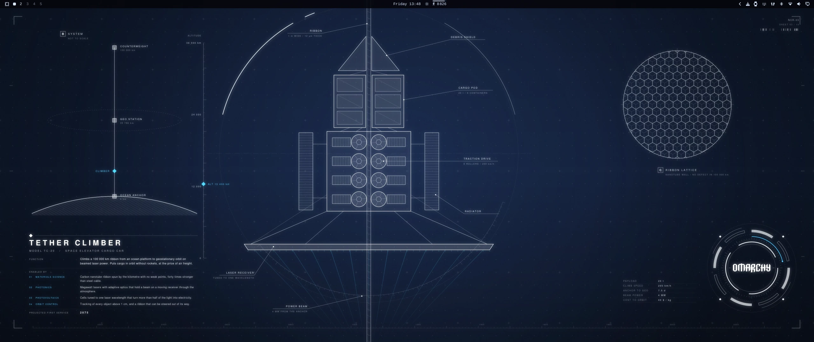
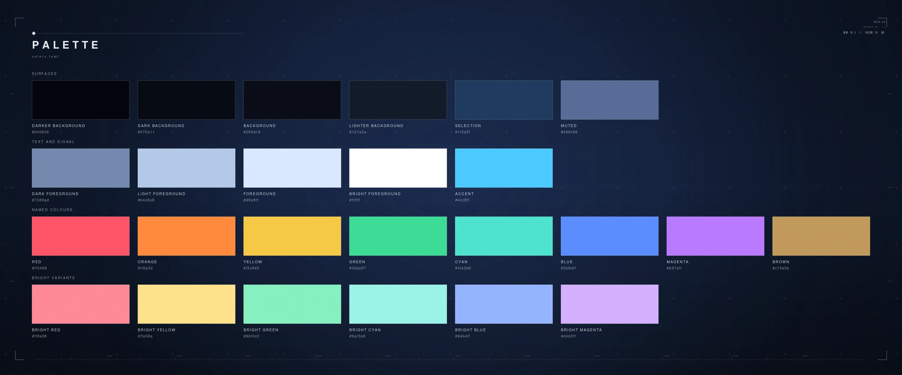
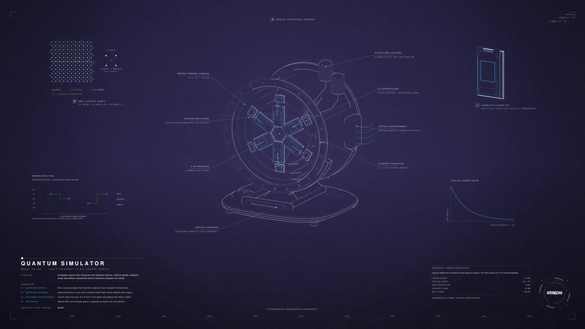
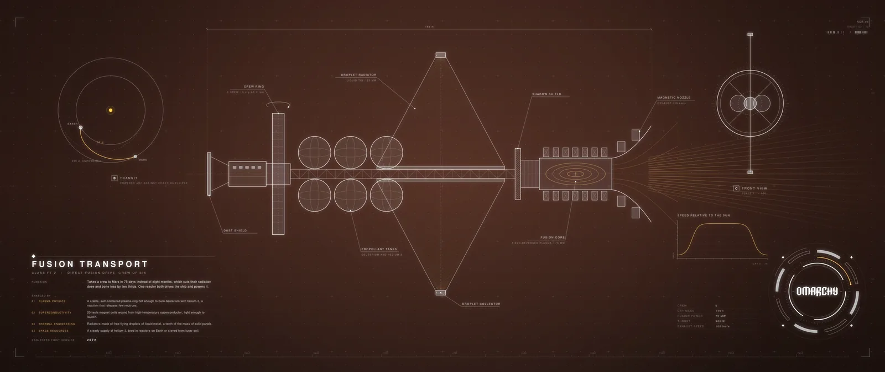
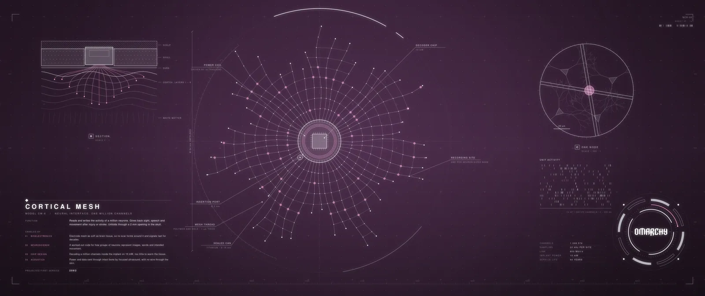
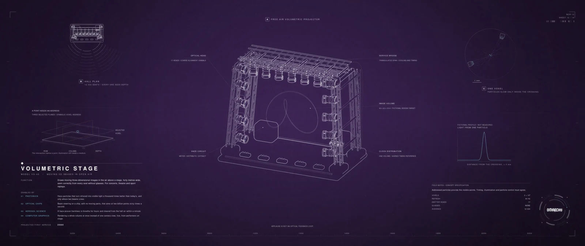
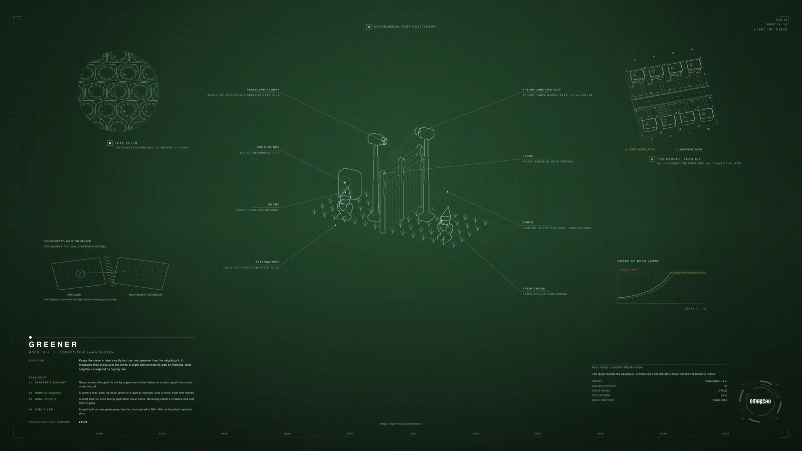
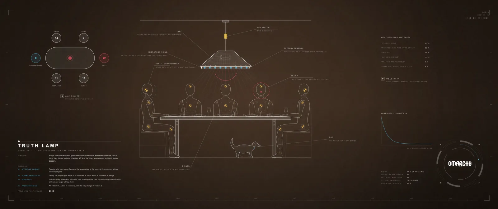

# Destiny — an Omarchy theme

A bold dark theme for [Omarchy](https://omarchy.org) 4 in the colours of the
first Destiny game: deep-space navy, ice-white text, square corners, thin
frames, and Arc blue, Void purple, Solar orange and exotic gold at full
strength.

It ships 42 wallpapers drawn as engineering sheets. Each shows a device that
does not exist yet, says what it does, and lists the discoveries it is waiting
for. Every sheet has its own colour mood.




*The gallery previews the default 16:9 layout. Both native formats retain
the full three-column layout, two service views, individual diagrams and Field Notes.*

Only the drawing technique is borrowed from the game — thin white line work,
tick rings, leader lines, spaced capitals. No weapon, character, place, symbol
or name from the game appears anywhere. This is a fan project, not affiliated
with or endorsed by Bungie.

The eight latest machines and their research notes are documented in
[Extension to 42](docs/collection/EXTENSION-42.pl.md).

## Install

```bash
omarchy theme install https://github.com/ncr/omarchy-destiny-theme.git
omarchy theme set destiny
```

Or use *Install > Style > Theme* in the Omarchy menu and paste the URL.

Requires Omarchy 4. The theme uses the semantic `colors.toml` keys and the
per-section `shell.*.toml` files, neither of which exists in older versions.
The wallpapers are WebP, which Omarchy displays since the update of 19 August
2026 (it adds `qt6-imageformats`). If they show up black, run `omarchy update`.

### Automatic screen-format selection

For the theme **with its companion app**, run this after installing the theme:

```bash
python3 ~/.config/omarchy/themes/destiny/companion/install.py
```

The installer opens Destiny Wallpapers automatically. First-launch setup
explains the **Optimal set**, selected automatically across all monitors.
It shows only this set: resolution, MB and the visible area on each monitor.
Enter continues; Escape cancels. There is no size-policy chooser.
The application menu opens a large-font full-screen TUI; subsequent launches
go straight to the gallery. Use `destiny-wallpapers --configure` to review it.

Both native formats live on **main**; there is no separate ultrawide branch:

| Location | Native wallpaper layout |
|---|---|
| `backgrounds/` | 16:9, 5120×2880; theme-only default |
| `wallpaper-variants/wide/` | Ultrawide, 5120×2160 |

A user-local hook preserves the selection when Destiny is reapplied.
Use `--no-launch` to install without opening the app, and
`destiny-wallpapers --configure` to compare formats again.

Readable reflow with larger type for 1080p and 1440p remains in development.
Resolution quality and text readability are assessed separately. Omarchy
currently shares one wallpaper across monitors; the app first avoids
upscaling on any screen, then minimizes cropping. Among equally suitable
sets it recommends the smallest total file size, not the highest resolution.
Each option shows the actual total MB. All formats
remain bundled; the selection does not remove other formats from disk. Changing focus does not
change the recommendation. The viewer always fits the complete sheet.

[Companion setup, controls and limitations](companion/README.md).

## Screenshots

Taken on a running Omarchy 4.0.4 desktop, before the current wallpaper revision.
The two wide ones show the ultrawide layout.





## Palette

Deep-space navy, ice-white text, and the game's colours at full strength: Arc
blue as the accent, Void purple, Solar orange, exotic gold. It is meant to be
as loud as Aetheria or Hackerman, in a different key.



| Key | Value | Used for |
|-----|-------|----------|
| `darker_background` | `#04060b` | bar, tooltips, scrims |
| `dark_background` | `#070a11` |  |
| `background` | `#090d16` | windows, menus, cards |
| `lighter_background` | `#121a2a` | floats, raised surfaces |
| `selection` | `#1f3a5f` | selected text |
| `muted` | `#586c96` | inactive text, rules |

Contrast ratios (WCAG) against the two surfaces text is drawn on. Every named
colour clears 5.5 : 1 on both. `muted` is for inactive text and rules, not for
reading.

| Key | Value | | on `background` | on `lighter_background` |
|-----|-------|-|-----------------|-------------------------|
| `foreground` | `#d9e8ff` |  | 15.67 | 14.03 |
| `bright_foreground` | `#ffffff` |  | 19.43 | 17.40 |
| `light_foreground` | `#b4c8e8` |  | 11.44 | 10.25 |
| `accent` | `#4cc9ff` | Arc | 10.28 | 9.20 |
| `red` | `#ff5468` | hostile | 6.22 | 5.57 |
| `orange` | `#ff8a3d` | Solar | 8.29 | 7.42 |
| `yellow` | `#f5c945` | exotic | 12.33 | 11.04 |
| `green` | `#3ddc97` | uncommon | 10.99 | 9.85 |
| `cyan` | `#4fe3d0` | the star chart | 12.24 | 10.96 |
| `blue` | `#5b8dff` | rare | 6.20 | 5.55 |
| `magenta` | `#b97aff` | Void, legendary | 6.75 | 6.04 |
| `brown` | `#c19a5b` | bronze | 7.44 | 6.66 |
| `dark_foreground` | `#7389ad` |  | 5.47 | 4.90 |
| `muted` | `#586c96` |  | 3.70 | 3.31 |

The focused window is framed in a gradient from Arc into Void,
`hyprland_active_border = "rgba(4cc9ffee) rgba(b97affee) 45deg"`. Popups,
notifications, the menu and the lock screen use the same gradient.

## What it ships

| File | What it does |
|------|--------------|
| `colors.toml` | The palette. Omarchy generates the terminal, btop, Neovim, VS Code, Hyprland border and other configs from it. |
| `shell.*.toml` | One file per section of the Omarchy shell (`menu`, `launcher`, `controls`, `notifications`, …). Each replaces that section of the generated `shell.toml`; everything else keeps following Omarchy's template. |
| `icons.theme`, `chromium.theme` | Icon set and browser colour. |
| `backgrounds/` | Fourteen wallpapers. |
| `preview.png`, `previews/` | Images for the theme picker and this page. |
| `companion/`, `destiny-wallpapers` | Optional wallpaper browser, user-local installer and menu integration. |
| `tools/` | The Python program that draws the wallpapers, and a copy of the Omarchy logo it reads. |

Installing only the theme through Omarchy does not execute companion code:
no Lua, no terminal config, no `vscode.json`.

### How the menus get their look

- Menu and launcher rows are pale blue. The row under the cursor turns white,
  fills with Arc at 16 % and gets a full Arc frame — the way the game marks the
  item you point at, only in colour.
- The menu, popups, notifications and the lock screen have a 1 px frame in the
  Arc-to-Void gradient of the focused window.
- The notification countdown is exotic gold; bar modules that want attention
  turn Solar orange.
- The bar is the darkest surface on screen and 90 % opaque.
- Window rounding stays at Omarchy's default of 0, which is what the game uses.

## Wallpapers

Each sheet shows a device with a real job that needs breakthroughs nobody has
made yet and could plausibly be built within about fifty years. The legend at
the bottom left names the device, says what it does, lists what had to be
discovered first and in which discipline, and gives a projected year of first
service. Pick one with `Super + Ctrl + Space`, or cycle with `omarchy theme bg next`.

| | Device | What it does | Year | Mood |
|-|--------|--------------|------|------|
| 01 | Quantum Simulator | Computes exactly how molecules and materials behave | 2058 | indigo, Arc blue |
| 02 | Sky Racer | One-seat electric racer that flies gates at 320 km/h and refuses to crash | 2052 | petrol, orange |
| 03 | Fusion Transport | Takes six crew to Mars in 75 days | 2072 | rust, amber |
| 04 | Greener | Keeps your lawn exactly 4 % greener than the neighbour's | 2049 | grass green |
| 05 | Cortical Mesh | Gives back sight, speech and movement after injury | 2062 | plum, pink |
| 06 | Bounder | Powered legs: 62 km/h and a six-metre high jump | 2064 | royal blue, yellow-green |
| 07 | Air Refinery | Makes jet fuel from air, water and sunlight | 2055 | olive, lime |
| 08 | Aroma Organ | Plays any of two million smells on cue, then clears the air | 2050 | wine, peach |
| 09 | Tether Climber | Lifts 20 t to geostationary orbit on beamed laser power | 2075 | navy (the theme's own), Arc blue |
| 10 | Truth Lamp | Glows red over the dinner table when anyone says what they do not believe | 2046 | umber, red |
| 11 | Organ Foundry | Prints a kidney from the patient's own cells and matures it for 21 days | 2068 | teal, coral |
| 12 | Volumetric Stage | Moving 3D images in open air above a stage, no glasses | 2060 | violet, cyan |
| 13 | Proxy | Runs 10 km every morning wearing your fitness watch, so your insurer thinks you did | 2047 | sand, Arc blue |
| 14 | Presence Rig | Suit and floor that let a player walk, climb and fight in a game and feel it | 2057 | graphite, mint |

Three kinds of sheet take turns. Six are serious: Quantum Simulator, Fusion
Transport, Cortical Mesh, Air Refinery, Tether Climber, Organ Foundry. Five are
for fun: racing, sport, smell, shows and games. Three are jokes told with a
straight face — Greener, Truth Lamp and Proxy: each device works, and each
exists only because people are the way they are. Read the small print.

The order is arranged by hand in `tools/order.py`: neighbours are far apart in
hue, so every switch changes how the desktop feels, and the first sheet is the
one closest to the theme's own navy. A sheet's number, its file name and the
`NCR-07` printed on it all come from its place in that list.

The numbers on the sheets are made up, but they are checked against each
other: the refinery's 13 000 t of fuel matches its 40 000 t of CO₂ and its
40 ha of mirrors at 21 % efficiency; six 95 kW fans make the racer's 570 kW.

| | |
|-|-|
|  |  |
|  |  |
|  |  |

### The emblem

The bottom right corner carries the Omarchy wordmark, drawn from Omarchy's own
`logo.svg`, inside a set of segmented rings in the sheet's accent colour. The
function that draws it takes a loop phase from 0 to 1, and every ring turns a
whole number of times per loop, so it is ready to be animated once Omarchy
plays video backgrounds.

### Destiny Wallpapers companion app

An optional fullscreen browser with keyboard navigation, automatic screen-format
selection and a first-launch explanation. Install and open it from this checkout:

```bash
omarchy pkg add imv      # only if missing
python3 companion/install.py
```

Open **Destiny Wallpapers** from the application menu, or run
`destiny-wallpapers`. Use **← / →** to browse, **F** for fullscreen,
**I** for the filename, and **Esc** to close. The app reads current images
from the checkout: all 42 retained sheets, including on a fresh clone. Rejected studies are excluded.

[Installation, updates and removal](companion/README.md).

### Fullscreen development viewer

Run `./wallpapers` from the repository, or `./wallpapers tether` to start at a
particular wallpaper (`./wallpapers 9` works too). Requires `imv`.

- **Left / Right:** previous / next wallpaper, wrapping at the ends.
- **Esc:** close the viewer.
- **Super+O:** fullscreen ↔ floating, pinned preview (local Hyprland integration).
- **I:** toggle filename and position; **Home / End:** first / last.

The view starts fullscreen, fits the entire image without cropping, and reloads
the displayed file when it changes. It uses its own bindings, without changing
your normal image-viewer configuration or desktop background.

The default collection is `concepts/development/`, falling back to `backgrounds/`
on a fresh checkout. Regenerate the development set with `./wallpapers --render`.
While the viewer is open, update a single wallpaper with:

```bash
python3 tools/make_wallpapers.py --only 9 --out concepts/development
```

Use `./wallpapers --dir concepts/tether-details` for a separate review directory,
or `./wallpapers --list` to see the current collection. Only numbered wallpaper
files are included; comparison crops and previews are excluded.

### Century: 100 new wallpapers

The [Century collection](docs/century/README.pl.md) contains 100 new devices,
stories and authored Blender models, exported natively at 5120×2160 and
5120×2880. Browse the local collection with `./century` or open
`concepts/century/index.html` for search, domain filters and both formats.
The [concept catalogue](docs/century/CONCEPTS.md) documents every sheet.
Century is a separate review collection; the existing development viewer
and installed desktop collection keep their current contents.

### Rendering your own

For new artwork, start with the [wallpaper production guide](docs/WALLPAPER-PRODUCTION-GUIDE.pl.md)
(Polish). It records the visual direction, review lessons, anatomy and label
checks, reference images, and a workflow for growing the collection to about
100 distinct devices. Future sessions should read it before extending the set.

The wallpapers are drawn by a program, and the result is deterministic: the
same sources, command and rendering environment give byte-identical files.

The current sheets use detailed technical contours, schematic crash-test
figures, locally fading construction lines and restrained grain. Text is set
deterministically in Nimbus Sans and the Omarchy wordmark uses the original
SVG. `--style original` selects the preceding line treatment. See
[the drawing conventions](tools/FIDELITY.md) for rendering and label checks.

```bash
python3 tools/make_wallpapers.py --size 5120x2880                # 16:9 layout
python3 tools/make_wallpapers.py --size 5120x2160                # ultrawide layout
python3 tools/make_wallpapers.py --size 2880x1920 --inset 0      # one exact screen
python3 tools/make_wallpapers.py --only 12 --out /tmp/test       # one sheet
python3 tools/make_previews.py                                   # README images
```

The current development collection retains the complete three-column layout
in both native formats: a main illustration, two details, two diagrams, title,
Field Notes and the original Omarchy signature. A sits above the main drawing;
the quiet Easter egg is centred at the bottom. The taller format adds vertical
space without stretching the drawings. These full-width compositions are
intended to be displayed without cropping. `--inset` applies to the preceding
`--style original` compact layout.

Needs `python-cairo`, `python-numpy`, `python-pillow` and the Nimbus Sans font
(`gsfonts` on Arch).

| File | Contains |
|------|----------|
| `tools/sheet.py` | Drawing helpers, palettes, legend, emblem, output |
| `tools/order.py` | The order of the sheets and the palette of each |
| `tools/fidelity.py` | Authored construction details and schematic figures |
| `tools/starmap.py`, `tools/starmap_study.py` | Line hierarchy and spatial ink variation |
| `tools/label_layout.py`, `tools/verify_wallpaper_layout.py` | Label placement and clearance checks |
| `tools/devices.py` | The six serious sheets |
| `tools/leisure.py` | The five playful ones |
| `tools/foibles.py` | The three jokes |
| `tools/classic.py` | An earlier set, not shipped: `--set classic` |

Add your own backgrounds in `~/.config/omarchy/backgrounds/destiny/`.

## Credits

The Omarchy wordmark comes from [Omarchy](https://github.com/basecamp/omarchy),
MIT licensed. Text on the sheets is set in Nimbus Sans.

## License

MIT. See [LICENSE](LICENSE).
