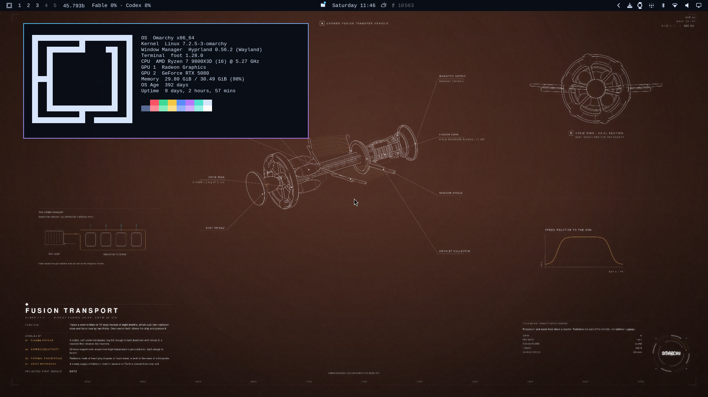
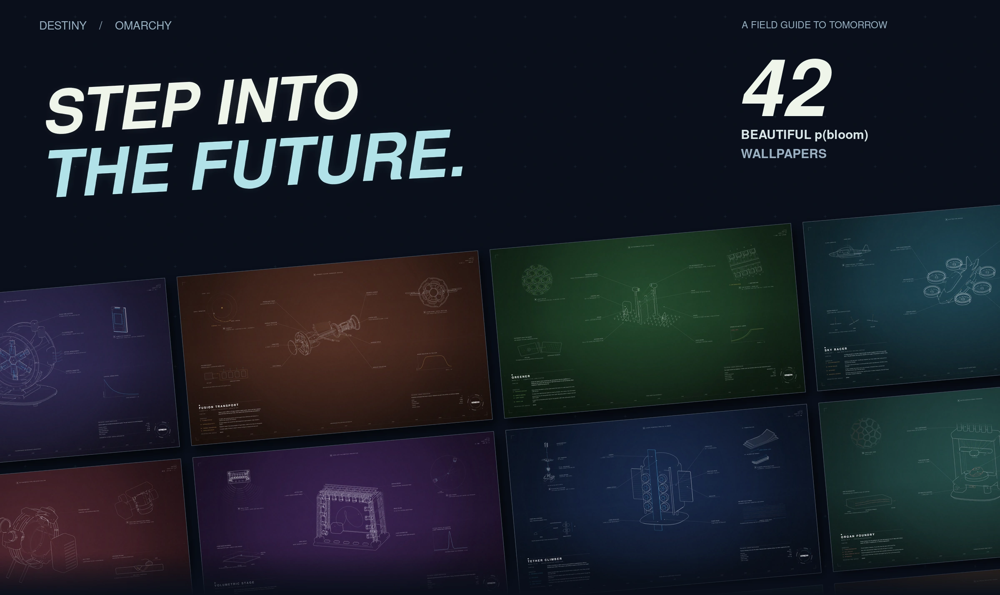
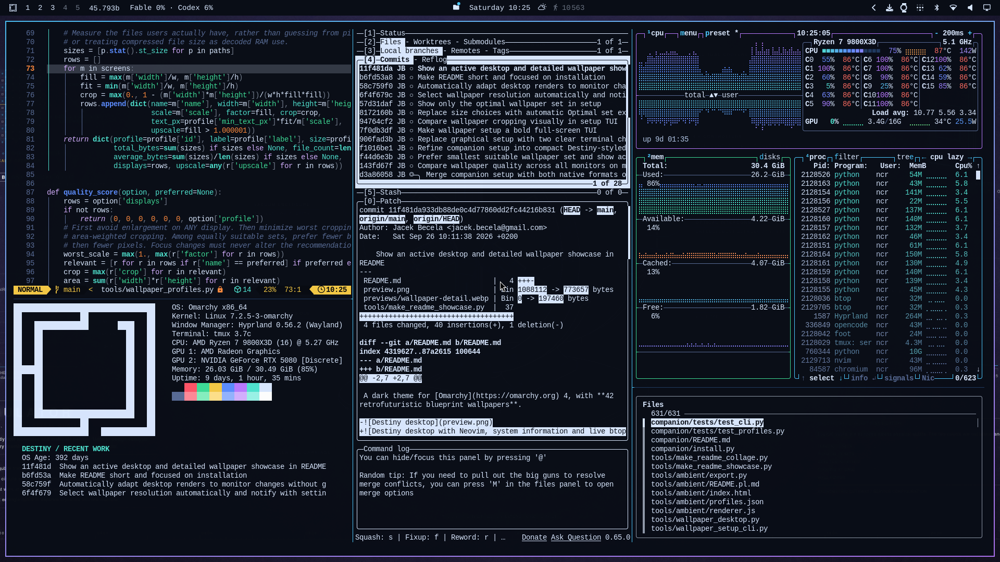

# Destiny Theme

A dark theme for [Omarchy](https://omarchy.org) 4, with **42 retrofuturistic blueprint wallpapers**.



## Install

```bash
omarchy theme install https://github.com/ncr/omarchy-destiny-theme.git
```

The companion automatically selects the best wallpaper resolution for your desktop, including when monitors change. No setup screens.

```bash
python3 ~/.config/omarchy/themes/destiny/companion/install.py
```

**Browse:** open **Destiny Wallpapers** from the app menu. **← / →** to browse, **Esc** to close.

**Settings:** `destiny-wallpapers --configure`





[All wallpapers](previews/wallpapers.webp) · [Detail close-up](previews/wallpaper-detail.webp) · [Companion details](companion/README.md) · [MIT license](LICENSE)

Inspired by Destiny; not affiliated with Bungie. Omarchy wordmark from [Omarchy](https://github.com/basecamp/omarchy).
