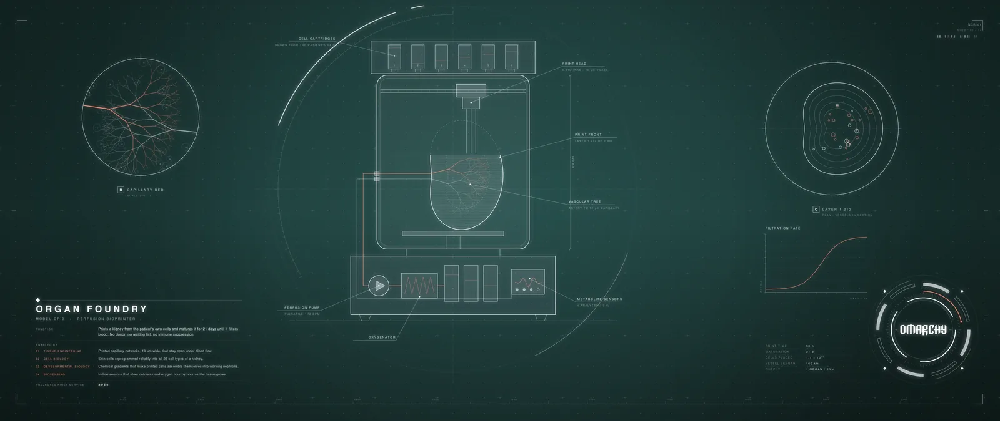
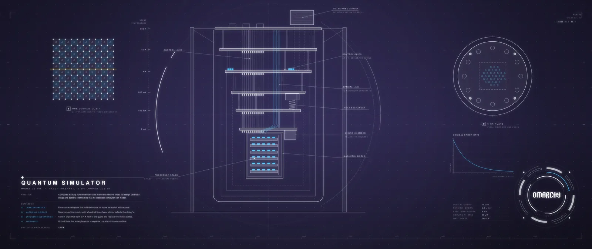
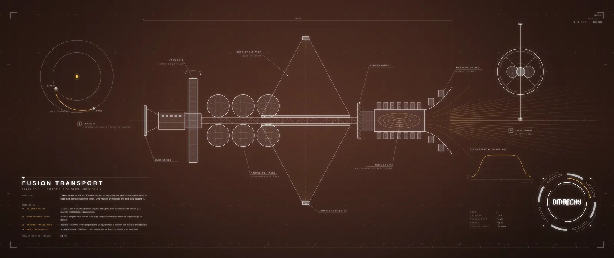
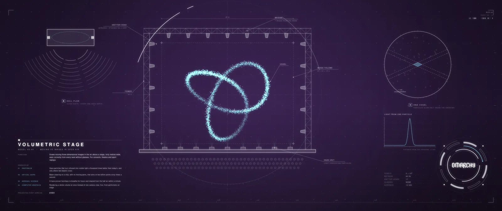
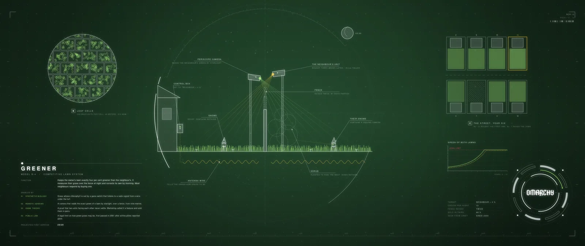
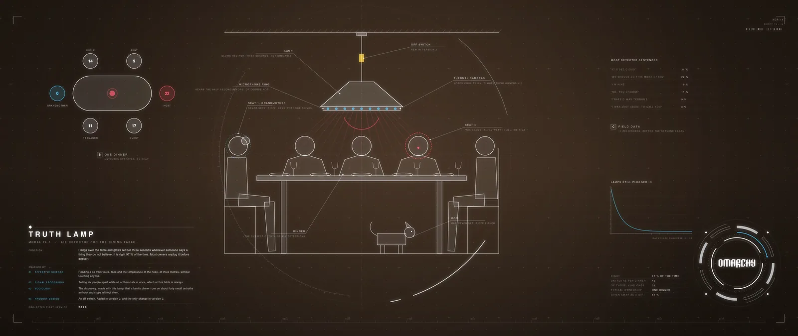

# Destiny — an Omarchy theme

A bold dark theme for [Omarchy](https://omarchy.org) 4 in the colours of the
first Destiny game: deep-space navy, ice-white text, square corners, thin
frames, and Arc blue, Void purple, Solar orange and exotic gold at full
strength.

It ships 14 wallpapers drawn as engineering sheets. Each shows a device that
does not exist yet, says what it does, and lists the discoveries it is waiting
for. Every sheet has its own colour mood.


*The sheets are shown here in their 21:9 version, which has the extra views.*

Only the drawing technique is borrowed from the game — thin white line work,
tick rings, leader lines, spaced capitals. No weapon, character, place, symbol
or name from the game appears anywhere. This is a fan project, not affiliated
with or endorsed by Bungie.

## Install

```bash
omarchy theme install https://github.com/ncr/omarchy-destiny-theme.git
omarchy theme set destiny
```

Or use *Install > Style > Theme* in the Omarchy menu and paste the URL.

Requires Omarchy 4. The theme uses the semantic `colors.toml` keys and the
per-section `shell.*.toml` files, neither of which exists in older versions.
The wallpapers are WebP, which Omarchy displays since the update of 19 August
2026 (it adds `qt6-imageformats`). If they show up black, run `omarchy update`.

### Ultrawide screens

Omarchy fits a wallpaper by cropping it, and these sheets keep a legend and an
emblem near the corners, so one file cannot suit every screen shape. The
repository has two branches:

| Branch | Wallpapers | For |
|--------|-----------|-----|
| `main` | 16:9, 5120×2880 | 16:9 at any size up to 5K. Also 16:10 and 3:2 laptops: the legend and the emblem sit far enough from the sides to survive that crop. |
| `ultrawide` | 21:9, 5120×2160 | 3440×1440, 5120×2160 and similar. These sheets add two secondary views, a chart and a data table. |

On an ultrawide screen, switch after installing:

```bash
git -C ~/.config/omarchy/themes/destiny switch ultrawide
omarchy theme set destiny
```

For any other shape, render a set for your exact screen — see
[Rendering your own](#rendering-your-own).

## Screenshots

Taken on a running Omarchy 4.0.4 desktop. The two wide ones show the
`ultrawide` branch.


## Palette

Deep-space navy, ice-white text, and the game's colours at full strength: Arc
blue as the accent, Void purple, Solar orange, exotic gold. It is meant to be
as loud as Aetheria or Hackerman, in a different key.


| Key | Value | Used for |
|-----|-------|----------|
| `darker_background` | `#04060b` | bar, tooltips, scrims |
| `dark_background` | `#070a11` |  |
| `background` | `#090d16` | windows, menus, cards |
| `lighter_background` | `#121a2a` | floats, raised surfaces |
| `selection` | `#1f3a5f` | selected text |
| `muted` | `#586c96` | inactive text, rules |

Contrast ratios (WCAG) against the two surfaces text is drawn on. Every named
colour clears 5.5 : 1 on both. `muted` is for inactive text and rules, not for
reading.

| Key | Value | | on `background` | on `lighter_background` |
|-----|-------|-|-----------------|-------------------------|
| `foreground` | `#d9e8ff` |  | 15.67 | 14.03 |
| `bright_foreground` | `#ffffff` |  | 19.43 | 17.40 |
| `light_foreground` | `#b4c8e8` |  | 11.44 | 10.25 |
| `accent` | `#4cc9ff` | Arc | 10.28 | 9.20 |
| `red` | `#ff5468` | hostile | 6.22 | 5.57 |
| `orange` | `#ff8a3d` | Solar | 8.29 | 7.42 |
| `yellow` | `#f5c945` | exotic | 12.33 | 11.04 |
| `green` | `#3ddc97` | uncommon | 10.99 | 9.85 |
| `cyan` | `#4fe3d0` | the star chart | 12.24 | 10.96 |
| `blue` | `#5b8dff` | rare | 6.20 | 5.55 |
| `magenta` | `#b97aff` | Void, legendary | 6.75 | 6.04 |
| `brown` | `#c19a5b` | bronze | 7.44 | 6.66 |
| `dark_foreground` | `#7389ad` |  | 5.47 | 4.90 |
| `muted` | `#586c96` |  | 3.70 | 3.31 |

The focused window is framed in a gradient from Arc into Void,
`hyprland_active_border = "rgba(4cc9ffee) rgba(b97affee) 45deg"`. Popups,
notifications, the menu and the lock screen use the same gradient.

## What it ships

| File | What it does |
|------|--------------|
| `colors.toml` | The palette. Omarchy generates the terminal, btop, Neovim, VS Code, Hyprland border and other configs from it. |
| `shell.*.toml` | One file per section of the Omarchy shell (`menu`, `launcher`, `controls`, `notifications`, …). Each replaces that section of the generated `shell.toml`; everything else keeps following Omarchy's template. |
| `icons.theme`, `chromium.theme` | Icon set and browser colour. |
| `backgrounds/` | Fourteen wallpapers. |
| `preview.png`, `previews/` | Images for the theme picker and this page. |
| `tools/` | The Python program that draws the wallpapers, and a copy of the Omarchy logo it reads. |

Nothing in this repository runs on your machine when the theme is installed:
no Lua, no terminal config, no `vscode.json`.

### How the menus get their look

- Menu and launcher rows are pale blue. The row under the cursor turns white,
  fills with Arc at 16 % and gets a full Arc frame — the way the game marks the
  item you point at, only in colour.
- The menu, popups, notifications and the lock screen have a 1 px frame in the
  Arc-to-Void gradient of the focused window.
- The notification countdown is exotic gold; bar modules that want attention
  turn Solar orange.
- The bar is the darkest surface on screen and 90 % opaque.
- Window rounding stays at Omarchy's default of 0, which is what the game uses.

## Wallpapers

Each sheet shows a device with a real job that needs breakthroughs nobody has
made yet and could plausibly be built within about fifty years. The legend at
the bottom left names the device, says what it does, lists what had to be
discovered first and in which discipline, and gives a projected year of first
service. Pick one with `Super + Ctrl + Space`, or cycle with `omarchy theme bg next`.

| | Device | What it does | Year | Mood |
|-|--------|--------------|------|------|
| 01 | Organ Foundry | Prints a kidney from the patient's own cells and matures it for 21 days | 2068 | teal, coral |
| 02 | Quantum Simulator | Computes exactly how molecules and materials behave | 2058 | indigo, Arc blue |
| 03 | Tether Climber | Lifts 20 t to geostationary orbit on beamed laser power | 2075 | navy (the theme's own), Arc blue |
| 04 | Cortical Mesh | Gives back sight, speech and movement after injury | 2062 | plum, pink |
| 05 | Fusion Transport | Takes six crew to Mars in 75 days | 2072 | rust, amber |
| 06 | Air Refinery | Makes jet fuel from air, water and sunlight | 2055 | olive, lime |
| 07 | Sky Racer | One-seat electric racer that flies gates at 320 km/h and refuses to crash | 2052 | petrol, orange |
| 08 | Volumetric Stage | Moving 3D images in open air above a stage, no glasses | 2060 | violet, cyan |
| 09 | Presence Rig | Suit and floor that let a player walk, climb and fight in a game and feel it | 2057 | graphite, mint |
| 10 | Aroma Organ | Plays any of two million smells on cue, then clears the air | 2050 | wine, peach |
| 11 | Bounder | Powered legs: 62 km/h and a six-metre high jump | 2064 | royal blue, yellow-green |
| 12 | Proxy | Runs 10 km every morning wearing your fitness watch, so your insurer thinks you did | 2047 | sand, Arc blue |
| 13 | Greener | Keeps your lawn exactly 4 % greener than the neighbour's | 2049 | grass green |
| 14 | Truth Lamp | Glows red over the dinner table when anyone says what they do not believe | 2046 | umber, red |

Sheets 01–06 are serious. 07–11 are for fun: racing, shows, games, smell and
sport. 12–14 are jokes told with a straight face: each device works, and each
exists only because people are the way they are. Read the small print.

The numbers on the sheets are made up, but they are checked against each
other: the refinery's 13 000 t of fuel matches its 40 000 t of CO₂ and its
40 ha of mirrors at 21 % efficiency; six 95 kW fans make the racer's 570 kW.

| | |
|-|-|
|  |  |
|  |  |
|  |  |

### The emblem

The bottom right corner carries the Omarchy wordmark, drawn from Omarchy's own
`logo.svg`, inside a set of segmented rings in the sheet's accent colour. The
function that draws it takes a loop phase from 0 to 1, and every ring turns a
whole number of times per loop, so it is ready to be animated once Omarchy
plays video backgrounds.

### Rendering your own

The wallpapers are drawn by a program, and the result is deterministic: the
same command gives byte-identical files.

```bash
python3 tools/make_wallpapers.py --size 5120x2880                # main branch
python3 tools/make_wallpapers.py --size 5120x2160                # ultrawide branch
python3 tools/make_wallpapers.py --size 2880x1920 --inset 0      # one exact screen
python3 tools/make_wallpapers.py --only 8 --out /tmp/test        # one sheet
python3 tools/make_previews.py                                   # README images
```

`--inset` is how far the legend and the emblem stay from the sides. It
defaults to 150 units (of 1080) for 16:9, so those files survive cropping to
16:10 and 3:2, and to 0 otherwise. Above 2.1 : 1 the program adds the secondary
views.

Needs `python-cairo`, `python-numpy`, `python-pillow` and the Nimbus Sans font
(`gsfonts` on Arch).

| File | Contains |
|------|----------|
| `tools/sheet.py` | Drawing helpers, palettes, legend, emblem, output |
| `tools/devices.py` | Sheets 01–06, and which palette each sheet gets |
| `tools/leisure.py` | Sheets 07–11 |
| `tools/foibles.py` | Sheets 12–14 |
| `tools/classic.py` | An earlier set, not shipped: `--set classic` |

Add your own backgrounds in `~/.config/omarchy/backgrounds/destiny/`.

## Credits

The Omarchy wordmark comes from [Omarchy](https://github.com/basecamp/omarchy),
MIT licensed. Text on the sheets is set in Nimbus Sans.

## License

MIT. See [LICENSE](LICENSE).
